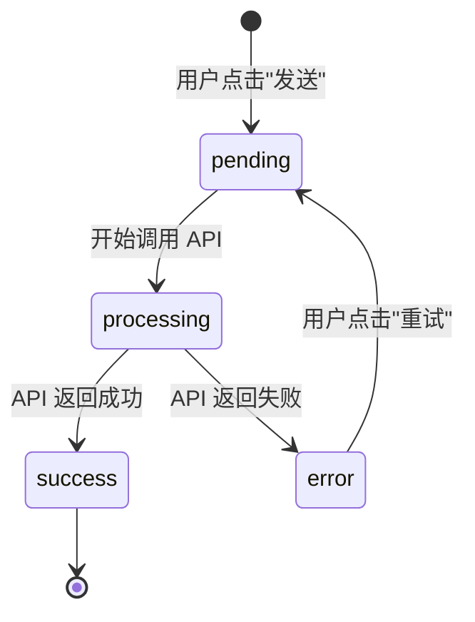
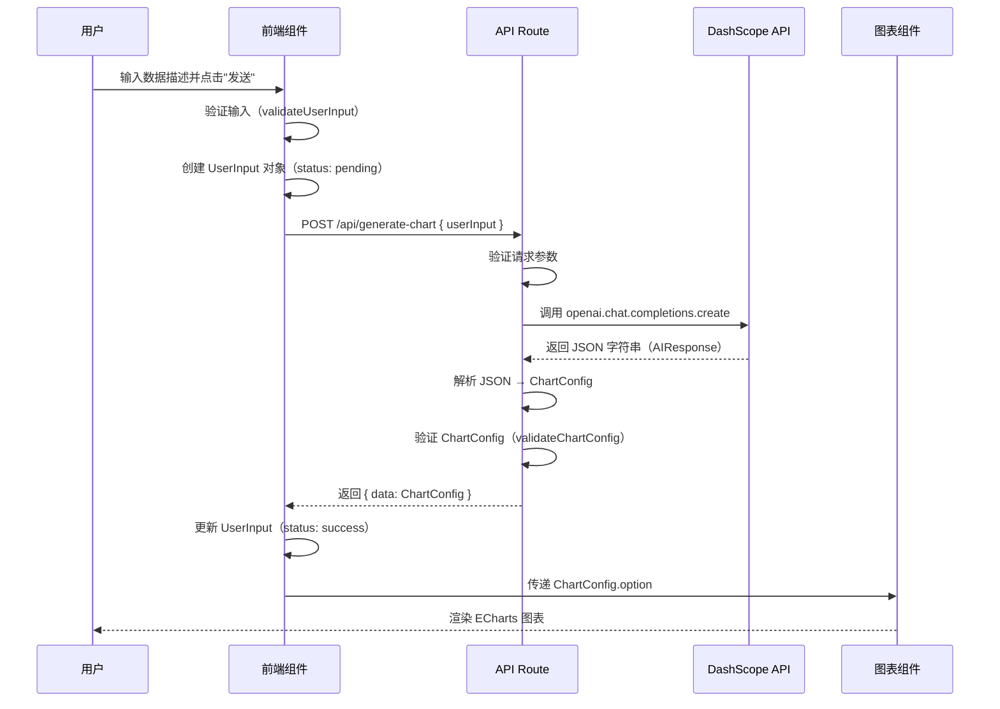
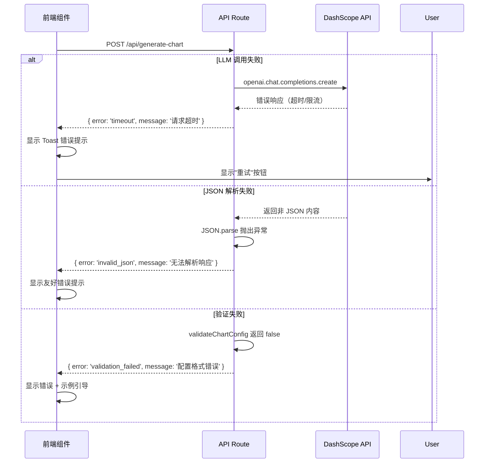
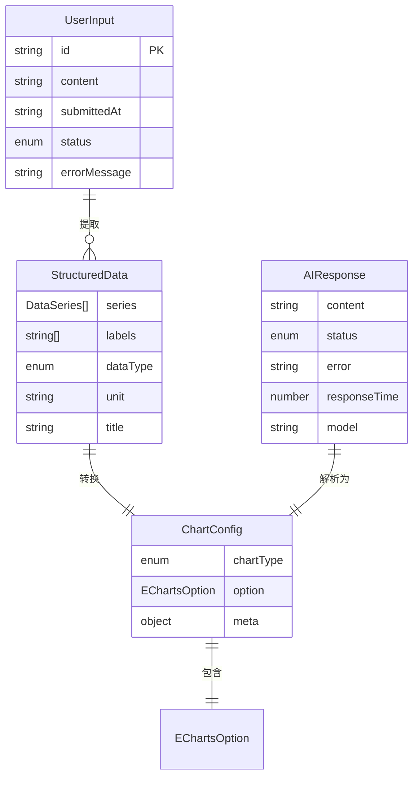

# Data Model: AI Chart Generator Homepage

**Feature**: 001-ai-chart-homepage  
**Date**: 2026-02-24  
**Phase**: Phase 1 - Data Model Design

## Overview

本文档定义了 AI 图表生成器首页功能的核心数据模型，包括实体结构、数据流、验证规则和状态转换。所有类型定义将实现在 `types/` 目录中，遵循 TypeScript strict 模式。

---

## Core Entities

### 1. UserInput（用户输入）

**描述**：用户在输入框中提交的原始自然语言文本。

**存储位置**：前端状态（React state）、可选的 localStorage（历史记录）

**TypeScript 定义** (`types/models.ts`)：

```typescript
export interface UserInput {
  /** 原始文本内容 */
  content: string;
  
  /** 提交时间戳（ISO 8601 格式） */
  submittedAt: string;
  
  /** 输入 ID（用于历史记录追踪） */
  id: string;
  
  /** 输入状态 */
  status: 'pending' | 'processing' | 'success' | 'error';
  
  /** 错误信息（如果状态为 error） */
  errorMessage?: string;
}
```

**字段说明**：

| 字段         | 类型   | 必需 | 说明                                          |
| ------------ | ------ | ---- | --------------------------------------------- |
| content      | string | ✅    | 用户输入的原始文本，长度 1-2000 字符          |
| submittedAt  | string | ✅    | ISO 8601 时间戳，例如："2026-02-24T10:30:00Z" |
| id           | string | ✅    | UUID v4 格式，用于唯一标识每次输入            |
| status       | enum   | ✅    | 输入处理状态，影响 UI 显示                    |
| errorMessage | string | ❌    | 仅在 status 为 'error' 时存在，显示错误原因   |

**验证规则**：

```typescript
export function validateUserInput(input: string): { valid: boolean; error?: string } {
  // 1. 非空验证
  if (!input.trim()) {
    return { valid: false, error: '输入内容不能为空' };
  }
  
  // 2. 长度验证
  if (input.length > 2000) {
    return { valid: false, error: '输入内容不能超过 2000 字符' };
  }
  
  // 3. 内容验证（可选，检查是否包含数字）
  const hasNumber = /\d/.test(input);
  if (!hasNumber) {
    return { valid: false, error: '输入内容应包含数值数据，例如："2024年1月销售额100万"' };
  }
  
  return { valid: true };
}
```

**状态转换**：



---

### 2. StructuredData（结构化数据）

**描述**：从用户输入中提取的结构化数据，包含数值、标签和系列信息。

**存储位置**：API Route 处理过程中的中间数据（不持久化）

**TypeScript 定义** (`types/models.ts`)：

```typescript
export interface DataSeries {
  /** 数据系列名称（如"北京"、"销售额"） */
  name: string;
  
  /** 数值数组 */
  data: number[];
}

export interface StructuredData {
  /** 数据系列数组（可以有多个系列，如北京和上海的对比） */
  series: DataSeries[];
  
  /** 类别/标签数组（X 轴标签，如月份、城市名） */
  labels: string[];
  
  /** 数据类型标识 */
  dataType: 'timeSeries' | 'categorical' | 'percentage';
  
  /** 数据单位（如"万元"、"%"） */
  unit?: string;
  
  /** 图表标题（从用户输入提取或自动生成） */
  title?: string;
}
```

**字段说明**：

| 字段     | 类型         | 必需 | 说明                                |
| -------- | ------------ | ---- | ----------------------------------- |
| series   | DataSeries[] | ✅    | 至少包含 1 个数据系列               |
| labels   | string[]     | ✅    | 标签数量应与 series[].data 长度一致 |
| dataType | enum         | ✅    | 影响图表类型自动选择逻辑            |
| unit     | string       | ❌    | 显示在 Y 轴名称或 tooltip 中        |
| title    | string       | ❌    | 如果未提供，前端生成默认标题        |

**验证规则**：

```typescript
export function validateStructuredData(data: StructuredData): { valid: boolean; error?: string } {
  // 1. 系列非空
  if (!data.series || data.series.length === 0) {
    return { valid: false, error: '至少需要一个数据系列' };
  }
  
  // 2. 数据一致性
  const dataLength = data.labels.length;
  for (const series of data.series) {
    if (series.data.length !== dataLength) {
      return { valid: false, error: '数据系列长度与标签长度不一致' };
    }
  }
  
  // 3. 数据范围
  if (dataLength < 1 || dataLength > 1000) {
    return { valid: false, error: '数据点数量应在 1-1000 之间' };
  }
  
  return { valid: true };
}
```

**示例数据**：

```json
{
  "series": [
    { "name": "北京", "data": [120, 130, 150, 170, 180, 200] },
    { "name": "上海", "data": [100, 140, 160, 150, 190, 210] }
  ],
  "labels": ["1月", "2月", "3月", "4月", "5月", "6月"],
  "dataType": "timeSeries",
  "unit": "万元",
  "title": "2024年北京和上海月度销售额对比"
}
```

---

### 3. ChartConfig（图表配置）

**描述**：完整的 ECharts 图表配置对象，可直接用于渲染。

**存储位置**：前端状态（React state）

**TypeScript 定义** (`types/charts.ts`)：

```typescript
import type { EChartsOption } from 'echarts';

export type ChartType = 'line' | 'bar' | 'pie';

export interface ChartConfig {
  /** 图表类型 */
  chartType: ChartType;
  
  /** 完整的 ECharts option 对象 */
  option: EChartsOption;
  
  /** 元数据（用于调试或追踪） */
  meta?: {
    generatedAt: string;
    modelUsed: string;
    inputId: string;
  };
}
```

**字段说明**：

| 字段      | 类型          | 必需 | 说明                                                    |
| --------- | ------------- | ---- | ------------------------------------------------------- |
| chartType | ChartType     | ✅    | 影响前端选择渲染组件（LineChart/BarChart/PieChart）     |
| option    | EChartsOption | ✅    | 必须符合 ECharts 5.x 规范，包含 series、xAxis、yAxis 等 |
| meta      | object        | ❌    | 可选的元数据，用于日志记录或调试                        |

**验证规则**：

```typescript
export function validateChartConfig(config: ChartConfig): { valid: boolean; error?: string } {
  // 1. 图表类型验证
  if (!['line', 'bar', 'pie'].includes(config.chartType)) {
    return { valid: false, error: '不支持的图表类型' };
  }
  
  // 2. option 结构验证
  if (!config.option || !config.option.series || !Array.isArray(config.option.series)) {
    return { valid: false, error: '无效的 ECharts option 结构' };
  }
  
  // 3. 系列非空
  if (config.option.series.length === 0) {
    return { valid: false, error: 'series 不能为空' };
  }
  
  return { valid: true };
}
```

**示例数据**（折线图）：

```json
{
  "chartType": "line",
  "option": {
    "title": { "text": "2024年销售额趋势", "left": "center" },
    "tooltip": { "trigger": "axis" },
    "legend": { "data": ["北京", "上海"], "top": "30px" },
    "xAxis": {
      "type": "category",
      "data": ["1月", "2月", "3月", "4月", "5月", "6月"]
    },
    "yAxis": {
      "type": "value",
      "name": "销售额（万元）"
    },
    "series": [
      {
        "name": "北京",
        "type": "line",
        "data": [120, 130, 150, 170, 180, 200],
        "smooth": true,
        "itemStyle": { "color": "#5470C6" }
      },
      {
        "name": "上海",
        "type": "line",
        "data": [100, 140, 160, 150, 190, 210],
        "smooth": true,
        "itemStyle": { "color": "#91CC75" }
      }
    ]
  },
  "meta": {
    "generatedAt": "2026-02-24T10:30:00Z",
    "modelUsed": "qwen3-max-preview",
    "inputId": "uuid-v4-here"
  }
}
```

---

### 4. AIResponse（AI 响应）

**描述**：从 OpenAI SDK（DashScope）返回的原始响应数据。

**存储位置**：API Route 处理过程中的临时数据（不持久化）

**TypeScript 定义** (`types/api.ts`)：

```typescript
export interface AIResponse {
  /** 原始 LLM 响应内容（JSON 字符串） */
  content: string;
  
  /** 响应状态 */
  status: 'success' | 'error';
  
  /** 错误信息（如果状态为 error） */
  error?: string;
  
  /** 响应时间（毫秒） */
  responseTime?: number;
  
  /** 使用的模型名称 */
  model: string;
}
```

**字段说明**：

| 字段         | 类型   | 必需 | 说明                                          |
| ------------ | ------ | ---- | --------------------------------------------- |
| content      | string | ✅    | LLM 返回的 JSON 字符串，需要 JSON.parse 解析  |
| status       | enum   | ✅    | 'success' 表示 API 调用成功，'error' 表示失败 |
| error        | string | ❌    | 错误原因（超时、API 错误、格式错误等）        |
| responseTime | number | ❌    | API 调用耗时（毫秒），用于性能监控            |
| model        | string | ✅    | 例如："qwen3-max-preview"                     |

**错误类型**：

```typescript
export type AIErrorType =
  | 'timeout'        // API 超时（>30s）
  | 'rate_limit'     // 请求频率限制
  | 'invalid_json'   // 返回的不是有效 JSON
  | 'missing_fields' // JSON 缺少必需字段
  | 'api_error';     // DashScope API 返回错误

export interface AIError {
  type: AIErrorType;
  message: string;
  details?: any;
}
```

---

## Data Flow（数据流）

### 完整数据流程图



### 错误处理流程



---

## State Management（状态管理）

### 前端状态结构（React State）

```typescript
// app/page.tsx 或专用 Context
export interface AppState {
  /** 当前用户输入 */
  currentInput: string;
  
  /** 输入历史记录（可选） */
  inputHistory: UserInput[];
  
  /** 当前图表配置 */
  chartConfig: ChartConfig | null;
  
  /** 加载状态 */
  isLoading: boolean;
  
  /** 错误状态 */
  error: {
    message: string;
    type: AIErrorType;
  } | null;
  
  /** 布局状态（是否已生成图表） */
  hasChart: boolean;
}
```

### 状态更新流程

```typescript
// 示例：提交输入并生成图表
const handleSubmit = async (input: string) => {
  // 1. 验证输入
  const validation = validateUserInput(input);
  if (!validation.valid) {
    setError({ message: validation.error!, type: 'validation_error' });
    return;
  }
  
  // 2. 创建 UserInput 对象
  const userInput: UserInput = {
    id: crypto.randomUUID(),
    content: input,
    submittedAt: new Date().toISOString(),
    status: 'pending',
  };
  
  // 3. 更新状态：开始加载
  setIsLoading(true);
  setError(null);
  
  try {
    // 4. 调用 API
    const response = await fetch('/api/generate-chart', {
      method: 'POST',
      headers: { 'Content-Type': 'application/json' },
      body: JSON.stringify({ userInput: input }),
    });
    
    if (!response.ok) {
      const errorData = await response.json();
      throw new Error(errorData.message);
    }
    
    const { data } = await response.json();
    
    // 5. 更新状态：成功
    setChartConfig(data);
    setHasChart(true);
    userInput.status = 'success';
  } catch (err) {
    // 6. 更新状态：失败
    userInput.status = 'error';
    userInput.errorMessage = err.message;
    setError({
      message: err.message,
      type: 'api_error',
    });
  } finally {
    // 7. 结束加载
    setIsLoading(false);
    setInputHistory((prev) => [...prev, userInput]);
  }
};
```

---

## Entity Relationships（实体关系）



---

## Type Definitions Summary（类型定义汇总）

### 文件组织

```
types/
├── models.ts         # UserInput, StructuredData, DataSeries
├── charts.ts         # ChartType, ChartConfig
├── api.ts            # AIResponse, AIError, API 请求/响应类型
└── index.ts          # 统一导出
```

### 核心类型导出（`types/index.ts`）

```typescript
// 实体类型
export type { UserInput, StructuredData, DataSeries } from './models';
export type { ChartConfig, ChartType } from './charts';
export type { AIResponse, AIError, AIErrorType } from './api';

// 验证函数
export { validateUserInput, validateStructuredData } from './models';
export { validateChartConfig } from './charts';

// API 类型
export type {
  GenerateChartRequest,
  GenerateChartResponse,
  APIErrorResponse,
} from './api';
```

### API 请求/响应类型（`types/api.ts`）

```typescript
// POST /api/generate-chart 请求
export interface GenerateChartRequest {
  userInput: string;
}

// 成功响应
export interface GenerateChartResponse {
  data: ChartConfig;
}

// 错误响应
export interface APIErrorResponse {
  error: string;
  message: string;
  code?: number;
}
```

---

## Validation Strategy（验证策略）

### 分层验证

1. **前端验证**（即时反馈）：
   - 输入长度验证
   - 空值验证
   - 基础格式验证

2. **API 层验证**（安全防护）：
   - 请求体结构验证
   - 输入长度再次验证
   - 请求频率限制（rate limiting）

3. **LLM 响应验证**（数据质量保证）：
   - JSON 格式验证
   - 结构完整性验证（chartType、option、series）
   - 数据一致性验证（labels 与 data 长度）

### 验证工具库（可选使用 Zod）

```typescript
import { z } from 'zod';

// UserInput schema
export const UserInputSchema = z.object({
  content: z.string().min(1).max(2000),
  submittedAt: z.string().datetime(),
  id: z.string().uuid(),
  status: z.enum(['pending', 'processing', 'success', 'error']),
  errorMessage: z.string().optional(),
});

// ChartConfig schema
export const ChartConfigSchema = z.object({
  chartType: z.enum(['line', 'bar', 'pie']),
  option: z.object({
    series: z.array(z.any()).min(1),
  }),
  meta: z.object({
    generatedAt: z.string().datetime(),
    modelUsed: z.string(),
    inputId: z.string().uuid(),
  }).optional(),
});
```

---

## Performance Considerations（性能考虑）

### 数据大小限制

| 实体                  | 最大大小  | 原因              |
| --------------------- | --------- | ----------------- |
| UserInput.content     | 2000 字符 | 防止 LLM 调用超时 |
| StructuredData.labels | 1000 项   | 图表渲染性能上限  |
| ChartConfig JSON      | <100KB    | 网络传输效率      |

### 缓存策略（可选）

```typescript
// 缓存相同的用户输入结果（使用 Map 或 localStorage）
const chartCache = new Map<string, ChartConfig>();

export async function generateChartWithCache(input: string): Promise<ChartConfig> {
  const cacheKey = input.trim().toLowerCase();
  
  if (chartCache.has(cacheKey)) {
    return chartCache.get(cacheKey)!;
  }
  
  const config = await generateChart(input);
  chartCache.set(cacheKey, config);
  
  return config;
}
```

---

## Next Steps

Phase 1 继续：
1. ✅ **data-model.md** - 本文档（已完成）
2. ⏭️ **contracts/api-schema.md** - API 接口契约定义
3. ⏭️ **quickstart.md** - 快速开始指南

---

**Document Status**: ✅ Complete  
**Last Updated**: 2026-02-24  
**Next**: contracts/api-schema.md
